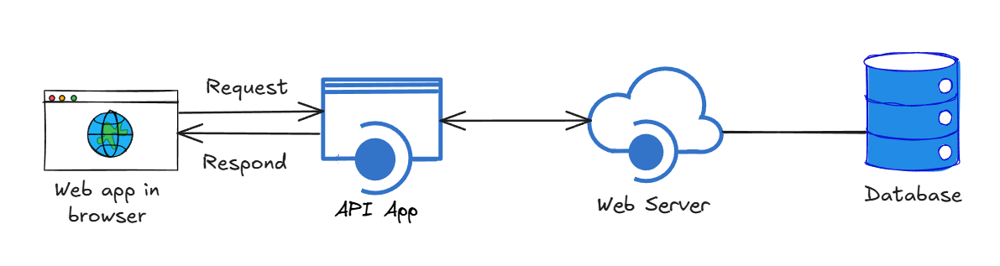

### API & Microservice

An API can be a command, function, or object, but at its core, it **receives a request and returns a response** to perform a task, without us needing to know how it works internally. We just need to know the **input, output, and how to use it**.

APIs usually return **pure data**, not user-facing interfaces. How that data is displayed or processed is up to the application.

In large applications, multiple small servers communicate via APIs. These servers handle small, independent tasks and are called **microservices** — they take input, process it, and return output, like a standalone module.

In short:
**Every small function can be seen as a mini-app. If it provides actions like adding, deleting, or updating data, that’s essentially its API.**

